# VORTREXYN — Premium Online Grocery Store

A full-stack multi-page web application for a premium online grocery store. Users can browse products by category, manage a cart, earn loyalty reward points, and receive order confirmation emails. An admin dashboard allows staff to manage products, categories, and generate AI-created product images.

## Screenshots

### Splash Screen


### Home
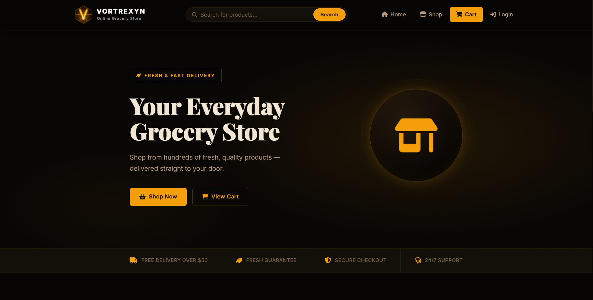

### Shop by Category
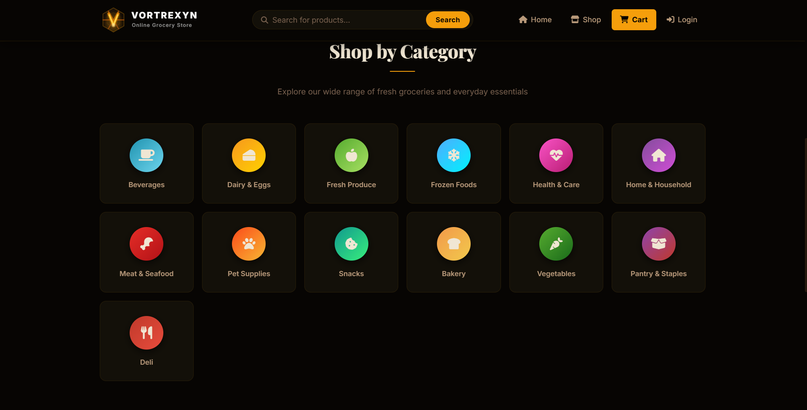

### All Products
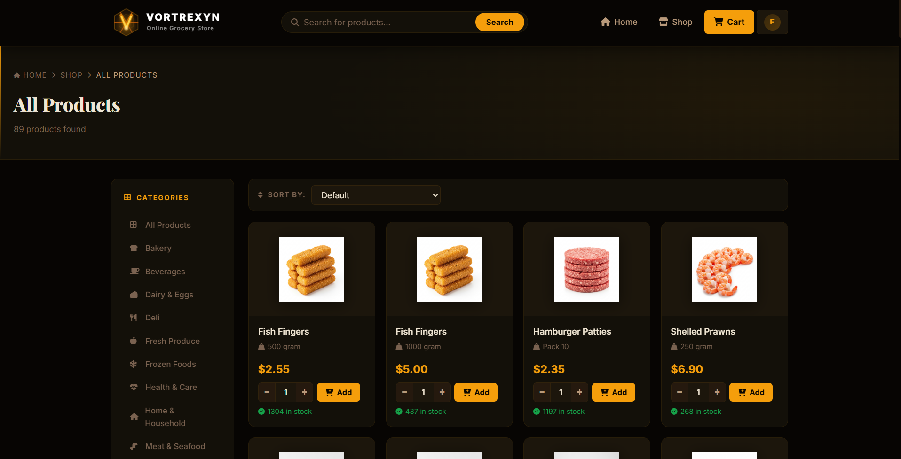

### Login
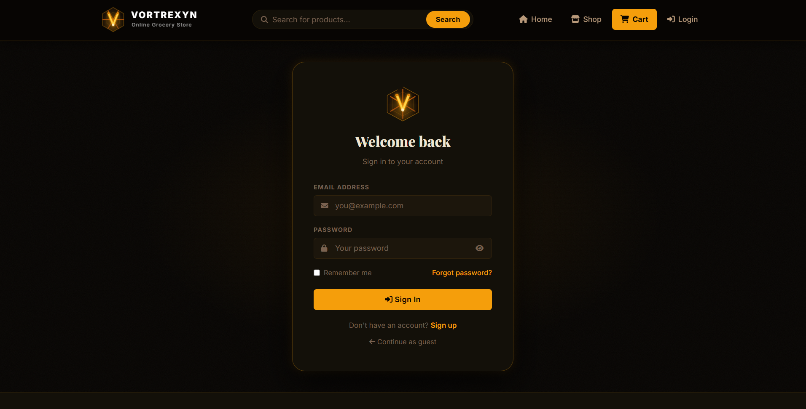

### Create Account
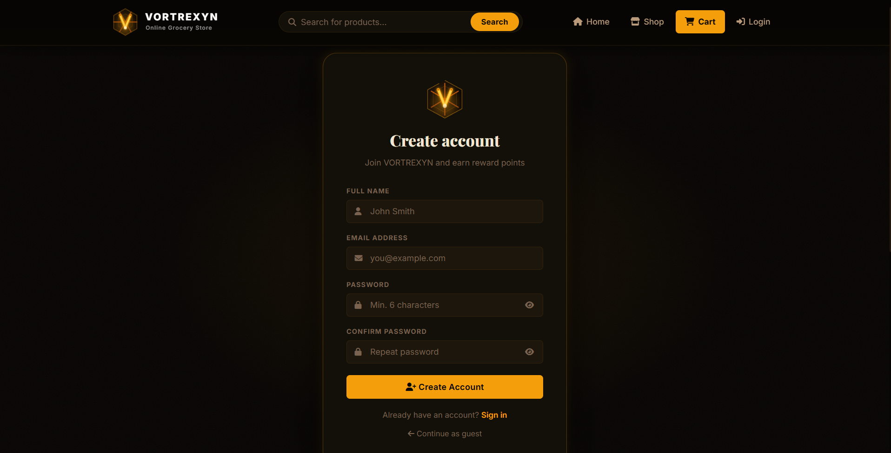

### Reset Password
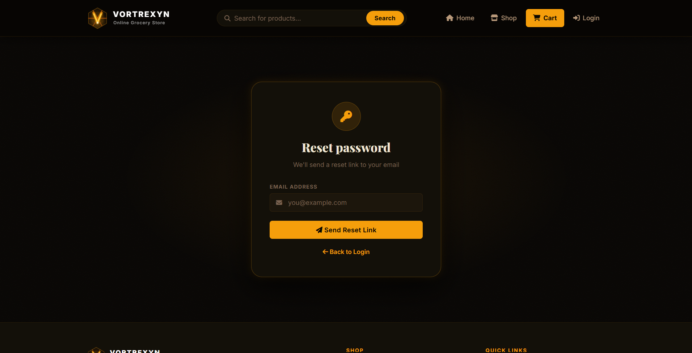

### Cart
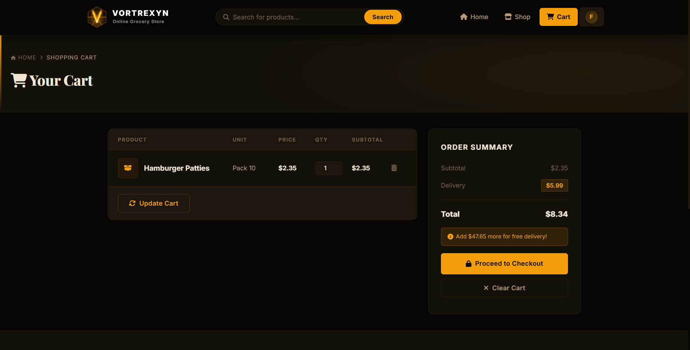

### Delivery Details
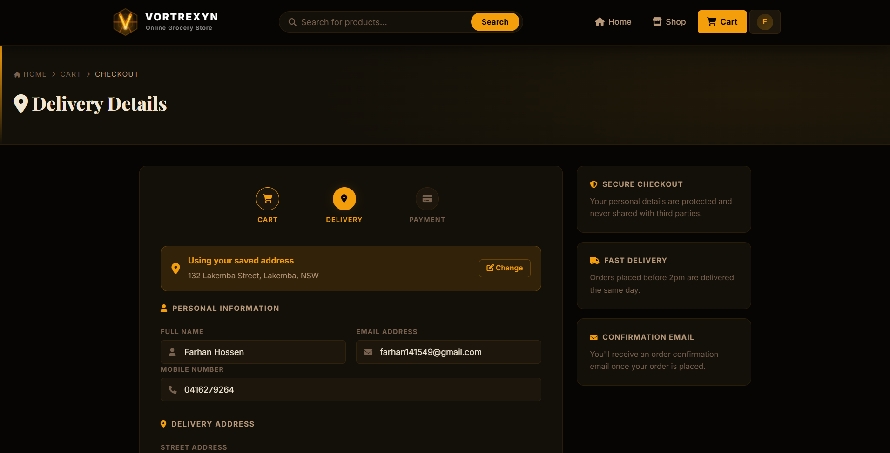

### Payment Details
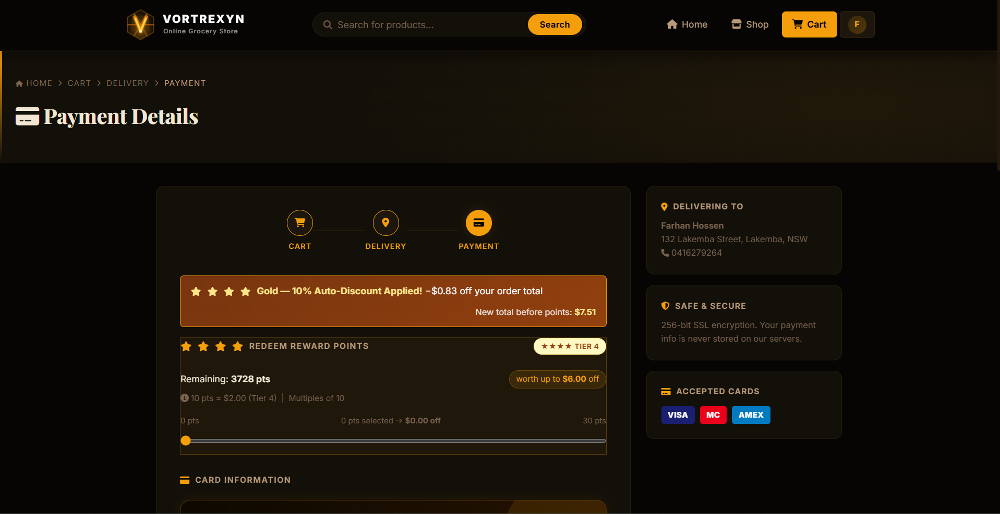

### Order Confirmed
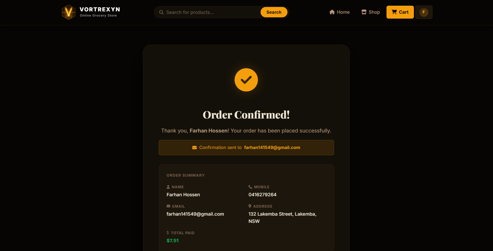

### Footer
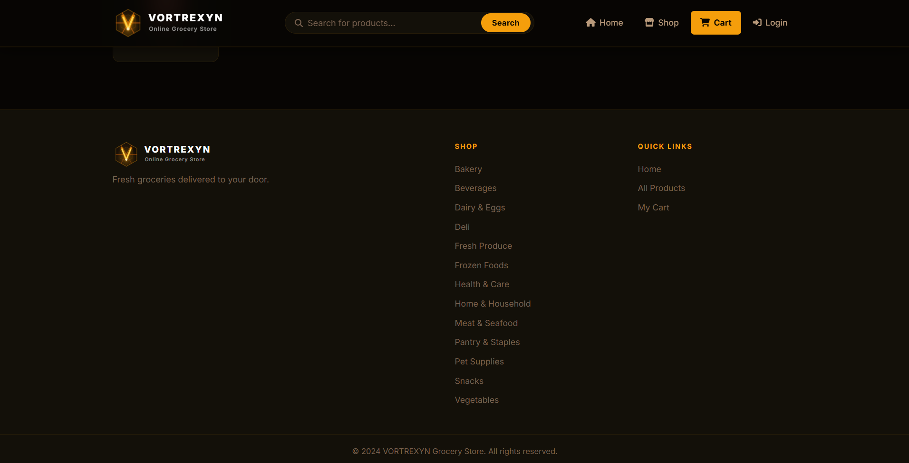

### Admin Login
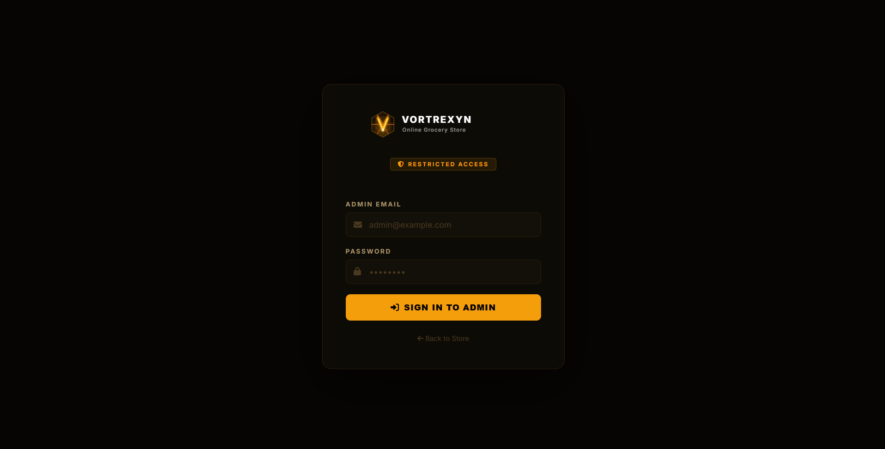

### Admin Dashboard
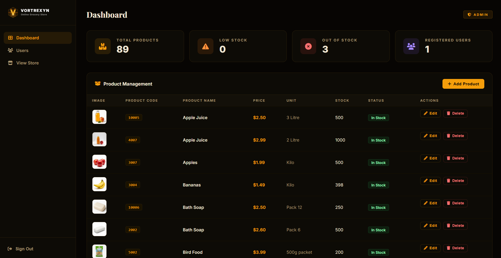

### Admin User Management
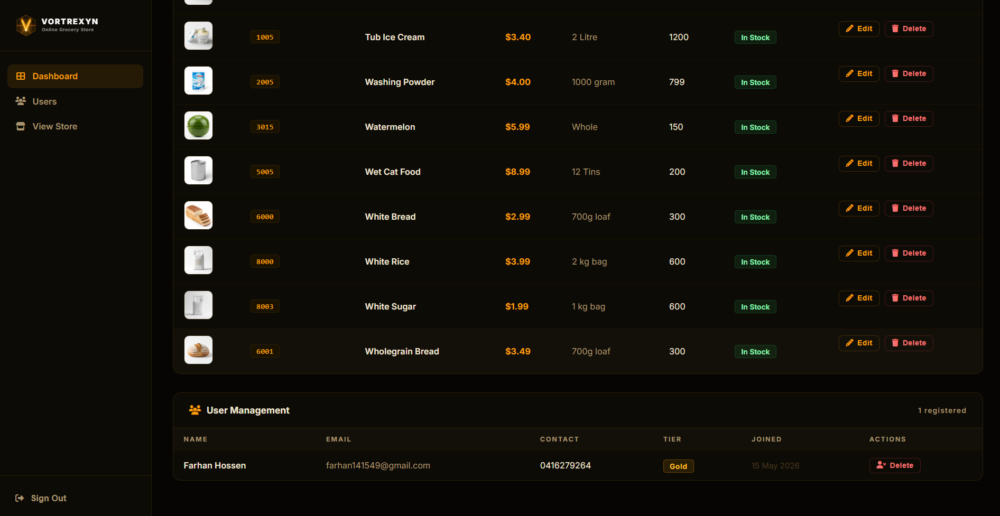

## Features

### User-Facing
- **Browse & Search** — browse 89+ products across 13 categories with live search by name
- **Cart** — add, update, and remove items with real-time subtotal and delivery fee calculation
- **Checkout** — multi-step flow: cart → delivery details → payment, with saved address auto-fill
- **Order Confirmation** — order written to Firestore with an automated confirmation email sent instantly
- **Reward Points** — every purchase earns points; redeem at checkout for discounts based on loyalty tier
- **Loyalty Tiers** — Iron → Bronze → Silver → Gold → Radiant, each with increasing point earn rates and auto-discounts
- **User Profile** — editable name, email, phone, and delivery address stored in Firestore

### Authentication
- Email/password registration and login via Firebase Auth
- Google OAuth sign-in
- Password reset via email link
- Protected routes — all account and checkout pages redirect to login if unauthenticated

### Admin Dashboard
- **Overview** — live stats: total products, low stock alerts, out-of-stock count, registered users
- **Product Management** — add, edit, and delete products with image upload; AI-generated product images via OpenAI
- **User Management** — view all registered users, their loyalty tier, contact details, and join date

### AI & Automation
- **OpenAI Image Generation** — admin inputs a product name and OpenAI returns a product image automatically
- **Nodemailer Automation** — transactional order confirmation emails with full order summary

### Platform & Infrastructure
- Netlify serverless functions host the entire Express app with no cold-start configuration required
- PostgreSQL on Neon for the product catalogue and session storage
- Firebase Firestore for user profiles, addresses, cart, and order history
- Firebase Storage for AI-generated product images
- Fully responsive dark/gold "Night Market Glow" premium UI across all screen sizes

## Project Structure

```
/
├── netlify.toml                        # Netlify build config, function routing, redirects
├── README.md                           # Project documentation
├── .gitignore
├── screenshots/                        # README documentation screenshots
│
└── VORTREXYN Online Grocery Store/
    ├── server.js                       # Express app entry point (also exported for Netlify)
    ├── package.json
    ├── .env.example                    # Environment variable template
    ├── products_export.sql             # PostgreSQL product seed data
    │
    ├── netlify/
    │   └── functions/
    │       └── server.js              # Serverless wrapper (serverless-http)
    │
    ├── config/
    │   ├── db.js                      # PostgreSQL connection pool (Neon)
    │   ├── firebase-admin.js          # Firebase Admin SDK initialisation
    │   └── mailer.js                  # Nodemailer transporter setup
    │
    ├── routes/
    │   ├── index.js                   # Home & splash page
    │   ├── products.js                # Product listing & search
    │   ├── cart.js                    # Cart, checkout, delivery, payment
    │   ├── auth.js                    # Login, signup, password reset
    │   ├── account.js                 # User profile & order history
    │   └── admin.js                   # Admin dashboard, product & user management
    │
    ├── views/
    │   ├── index.ejs                  # Home page
    │   ├── categories.ejs             # Shop by category
    │   ├── cart.ejs                   # Shopping cart
    │   ├── delivery.ejs               # Delivery details
    │   ├── payment.ejs                # Payment & reward points
    │   ├── order-confirmation.ejs     # Order confirmed page
    │   ├── account.ejs                # User profile
    │   ├── auth/
    │   │   ├── login.ejs
    │   │   ├── signup.ejs
    │   │   └── forgot-password.ejs
    │   ├── admin/
    │   │   ├── login.ejs
    │   │   └── dashboard.ejs
    │   └── partials/
    │       ├── header.ejs
    │       └── footer.ejs
    │
    └── assets/
        ├── css/styles.css             # Global styles — Night Market Glow dark theme
        ├── js/
        │   ├── firebase-init.js       # Firebase client-side initialisation
        │   └── auth.js                # Client-side auth helpers
        └── images/                    # Product images (local fallback)
```

## Tech Stack

| Layer | Technology |
|---|---|
| Frontend | HTML5, CSS3, Vanilla JavaScript |
| Templating | EJS (Embedded JavaScript) |
| Backend | Node.js + Express |
| Database | PostgreSQL (Neon) — product catalogue & sessions |
| Auth | Firebase Authentication (email/password + Google OAuth) |
| User Data | Cloud Firestore — profiles, cart, orders, addresses |
| Storage | Firebase Storage — AI-generated product images |
| AI — Images | OpenAI GPT-Image-1 |
| Email | Nodemailer (Gmail) |
| Serverless | Netlify Functions |
| Hosting & Deployment | Netlify |
| Domain & DNS | Cloudflare |
| Version Control | Git + GitHub |
